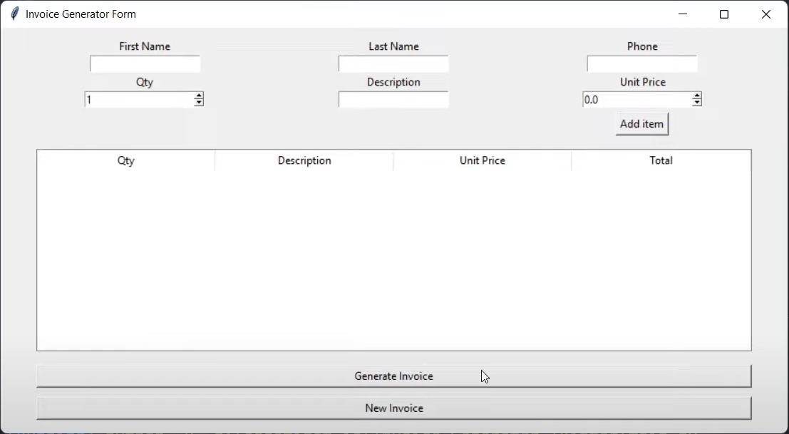

# Invoice Generator

Invoice Generator is a simple GUI-based application to help users generate invoices quickly and efficiently.

## Details

This application is built using Python with the help of `tkinter` for the GUI and `docx` for generating Word documents.

### Required Modules

You need to install the following Python modules:

- `tkinter` (usually comes with Python standard library)
- `docx`: For creating and updating Microsoft Word documents.
- `datetime`: For getting current date and time.

Install the required modules with: pip install python-docx

## Features

- Easy-to-use Graphical User Interface.
- Add items to the invoice with quantity, description, and price.
- View the list of added items.
- Generate a Word document with the complete invoice.
- Option to start a new invoice.

## Getting Started

1. Clone the repository: git clone [Your Repository URL]
2. Navigate to the directory and run the script: python [script_name].py

## How to Use

1. Fill in the customer's first name, last name, and phone number.
2. Add items to the invoice by specifying quantity, description, and unit price.
3. Click on "Generate Invoice" to save the invoice as a Word document.
4. Use the "New Invoice" button to start a fresh invoice.

## Screenshots

## Contributions

If you'd like to contribute, please fork the repository and use a feature branch. Pull requests are warmly welcome.

## License

This project is licensed under the MIT License - see the [LICENSE.md](LICENSE.md) file for details.

## Acknowledgements

- Thanks to the `tkinter` community for the comprehensive documentation.
- Special thanks to the `python-docx` library, which made Word document manipulations easier.